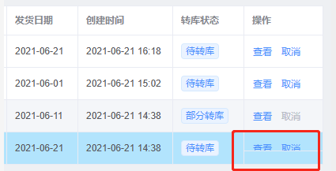
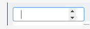
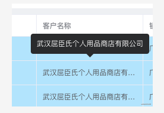

## ElementUI 问题清单总结

### form 下面只有一个 input 时回车键刷新页面

> 原因是触发了表单默认的提交行为，给el-form 加上@submit.native.prevent就行了。

``` html
<el-form inline @submit.native.prevent>
  <el-form-item label="订单号">
    <el-input
      v-model="query.orderNo"
      :placeholder="输入订单号查询"
      clearable
      @keyup.enter.native="enterInput"
    />
  </el-form-item>
</el-form>
```

### 表格固定列最后一行显示不全



> 这种情况有时在宽度刚好处于临界值状态时会出现。因为固定列是独立于表格body动态计算高度的，出现了固定列高度小于表格高度所以造成最后一行被遮挡。

``` css
  /* // 设置全局 */
.el-table__fixed-right {
  height: 100% !important;
}
```

### 气泡确认框文档里的confirm事件不生效

```js
// 将confirm改为onConfirm
@onConfirm="onDeleteOrder(row.id)"
```

### 输入框用正则限制但绑定值未更新

> 例子: 这样做虽然输入框的显示是正确的，但绑定的值是没有更新的，将 onkeyup 改为 oninput 即可。

```html
<el-input 
  v-model="form.retailMinOrder" 
  placeholder="请输入" 
  onkeyup="value=value.replace(/[^\d.]/g,'')" 
/>

```

> 解决方案

```html
<el-input 
  v-model="form.retailMinOrder" 
  placeholder="请输入" 
  @keyup.native="form.retailMinOrder=form.retailMinOrder.replace(/[^\d.]/g,'')"
/>
```

### 去除type="number"输入框聚焦时的上下箭头



```html
<el-input type="number" class="clear-number-input" />
```

```css
/* 设置全局 */
.clear-number-input.el-input::-webkit-outer-spin-button,
.clear-number-input.el-input::-webkit-inner-spin-button {
  margin: 0;
  -webkit-appearance: none !important;
} 
.clear-number-input.el-input input[type="number"]::-webkit-outer-spin-button,
.clear-number-input.el-input input[type="number"]::-webkit-inner-spin-button {
  margin: 0;
  -webkit-appearance: none !important;
}
.clear-number-input.el-input {
  -moz-appearance: textfield;
} 
.clear-number-input.el-input input[type="number"] {
  -moz-appearance: textfield;
}
```

### 只校验表单其中一个字段

> 在一些用户注册场景中，提交整个表单前有时候我们会做一些单独字段的校验，例如发送手机验证码，发送时我们只需要校验手机号码这个字段，可以这样做：

```js
this.$refs['form'].validateField('mobile', valid => {
  if (valid) {
    // 发送验证码
  }
})
```

> 如果需要多个参数，将参数改为数组形式即可。

### 弹窗重新打开时表单上次的校验信息未清除

> 有人会在open时在$nextTick里重置表单，而我选择在关闭时进行重置。

```html
<el-dialog @close="onClose">
  <el-form ref="form">
  </el-form>
</el-dialog>
```

```js
// 弹窗关闭时重置表单
onClose() {
  this.$refs['form'].resetFields()
}
```

### 表头与内容错位

```css
/* // 全局设置 */
.el-table--scrollable-y .el-table__body-wrapper {
 overflow-y: overlay !important;
}
```

### 表单多级数据结构校验问题

```html
<el-form :model="form">
  <el-form-item label="部门" prop="dept"></el-form-item>
  <el-form-item label="姓名" prop="user.name"></el-form-item>
</el-form>
```

```js
rules: {
  'user.name': [{ required: true, message: '姓名不能为空', trigger: 'blur' }]
}
```

### 表格跨分页多选

> 只需加上row-key和reserve-selection即可。

```html
<el-table row-key="id">
  <el-table-column type="selection" reserve-selection></el-table-column>
</el-table>
```

### 根据条件高亮行并去除默认hover颜色

```html
<el-table :row-class-name="tableRowClassName">
</el-table>
```

```js
tableRowClassName({ row }) {
  return row.status === 2 ? 'highlight' : ''
}
```

```css
/* // 设置全局 */
.el-table .highlight {
  background-color: #b6e8fe;
  &:hover > td {
    background-color: initial !important;
  }
  td {
    background-color: initial !important;
  }
}
```

### 表单不想显示label但又想显示必填星号怎么办

```html
<!--  label给个空格即可 -->
<el-form>
  <el-table>
    <el-table-column label="名称">
      <template>
        <el-form-item label=" ">
           <el-input placeholder="名称不能为空" />
        </el-form-item>
      </template>
    </el-table-column>
  </el-table>
</el-form>
```

### table 内嵌 input 调用 focus 方法无效

```html
<el-table>
  <el-table-column label="名称">
    <template>
      <el-input ref="inputRef" />
    </template>
  </el-table-column>
</el-table>
```

```js
// 无效
this.$refs['inputRef'].focus()
this.$refs['inputRef'][0].focus()
this.$refs['inputRef'].$el.children[0].focus()
```

```html
<!--  有效 -->
<el-input id="inputRef" />
```

```js
document.getElementById('inputRef').focus()
```

### 表格内容超出省略



> 其实只要加个show-overflow-tooltip就可以了，还自带tooltip效果，

```html
  <el-table-column label="客户名称" prop="customerName" show-overflow-tooltip>
</el-table-column>
```

### el-tree 展开/收起所有节点

```html
<el-tree ref="tree"></el-tree>
```

```js
expandTree(expand = true) {
  const nodes = this.$refs['tree'].store._getAllNodes()
  nodes.forEach(node => {
    node.expanded = expand
  })
}
```

## END

---
