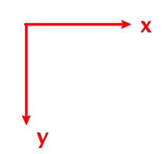
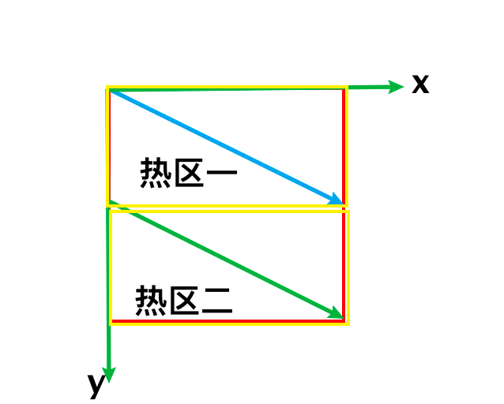

## HTML冷门实用标签

### 一、center

让你实现水平居中，用这个标签就对了，标签名也非常得语义化

```html
<center>test</center>
```

原理也很简单，其实就是这个标签自带了 text-align: center 的样式

### 二、abbr

abbr 全称是 abbreviations，意思是缩写。应用场景也很简单，为一些文章中的缩写增加注释

```html
<abbr title="Daily Active User">
    DAU
</abbr>
<!-- title 为注释内容，hove 展示 -->
```

<abbr title='Daily Active User'>DAU</abbr>

这个标签就可以把全称隐藏掉，弱化信息量，让真正不知道该缩写的用户主动去获取缩写的具体意思，这个在 markdown 里经常会出现

### 三、mark

`<mark/>` 在 markdown 中也是很常用的，用于将包裹的文本高亮展示

```html
<mark>高亮文本</mark>
```

<mark>高亮文本</mark>
如果全文统一高亮样式，可以专门对 mark 标签进行样式重置，这样就不用对你用的每个 div 加一个 highlight 的类名了，又不语义化，又徒增文档大小

### 四、sup、sub

`<sup/>`和`<sub/>`分别表示上标和下标，在 markdown 中出现得也很频繁，比如数学公式和引用

```html
<div>3<sup>[2]</sup></div>
<div>4<sub>2</sub></div>
```

<div>3<sup>[2]</sup></div>
<div>4<sub>2</sub></div>

上标和下标的样式原理也比较简单，主要就是利用了 vertical-align 的 top 和 sub 属性值，然后将字号缩小，不过有现成的标签，干嘛不用呢？

### 五、figure

figure 是用于包裹其它标签的内容的，然后再利用另一个标签 figcaption ，可以对包裹的内容进行一个文本描述，例如：

```html
<figure>
    
         <!-- 图片显示失败时展示该文本描述 -->
    <figcaption>这是一张大象的照片</figcaption>
</figure>
```

### 六、progress

 `<progress/>` 既有语义化，又有进度条的功能，

```html
<!-- 进度条最大值为100，当前进度为60，即60% -->
<progress max="100" value="60"/>
```

<progress max="100" value="60"/>

* 业务中我们也就可以通过控制 value 属性，来改变进度条的进度了

### 七、area

area 这个标签也非常有意思，它的作用是为图片提供点击热区，可以自己规定一张图的哪些区域可点击，且点击后跳转的链接，也可以设置成点击下载文件，

```html
  

  <map name="map">
    <area shape="rect" coords="0,0,100,50" alt="baidu" href="https://www.baidu.com">
    <area shape="rect" coords="0,50,100,100" alt="sougou" href="https://www.sogou.com/">
  </map>
```

area 一般要搭配 map 标签一起使用，每个 area 标签表示一个热区，例如上面代码中，我们定义了两个热区，热区形状都为rect（矩形），他们的热区分别是：

* 坐标 (0,0) 到 坐标 (100,50) 的一个矩形
* 坐标 (0,50) 坐标 (100,100) 的一个矩形
我们都知道，默认的坐标轴是这样的：

因此，我们划分的两个热区就是:


### 八、details

details 字面意思是 "详情"，在markdown里也经常用，用该标签包裹了的内容默认会被隐藏，只留下一个简述的文字，我们点击以后才会展示详细的内容

```html
<details>
  <p>我是一段被隐藏的内容</p>
</details>
```

<details >
  <p>我是一段被隐藏的内容</p>
</details>
* 这还没有加任何一行的 js 代码，我们点击后，details 标签上会多一个 open 的属性，被隐藏的内容就展示出来了

* 默认情况下，简要文字为 "详情"，想要修改这个文字，要搭配 summary 标签来使用

```html
<details>
  <summary>点击查看更多</summary>
  <p>我是一段被隐藏的内容</p>
</details>
```

<details>
  <summary>点击查看更多</summary>
  <p>我是一段被隐藏的内容</p>
</details>

### 九、dialog

浏览器自带弹窗方法 alert、confirm、prompt，样式固定且每个浏览器不同，同时还会阻塞页面运行，除了这个还提供了一个 dialog 标签，它的使用方式有点类似于现在各大组件库的 Modal 组件了，浏览器还为该标签提供了原生的 dom 方法：showModal、close，可以直接控制弹窗的展示和隐藏

```html
<dialog id="dialog">
    <input type="text">
    <button id="close">ok</button>
</dialog>
<button id="openBtn">打开弹框</button>

<script>
    const dialog = document.getElementById('dialog')
    const openBtn = document.getElementById('openBtn')
    const closeBtn = document.getElementById('close')
  
    openBtn.addEventListener('click', () => {
        // 打开弹框
        dialog.showModal()
    })
    closeBtn.addEventListener('click', () => {
        // 隐藏弹框
        dialog.close()
    })
</script>
```

* 这原生的弹框还自带背景蒙层，点击是关闭不掉的，但起码它不会阻塞页面
* 然后我们在弹窗展示时，也可以通过 esc 键来关闭弹窗

### 十、datalist

datalist 是用于给输入框提供可选值的一个列表标签，类似咱们常用的 Select 组件

```html
<label> 输入C开头的英文单词：</label>
<input list="c_words"/>

<datalist id="c_words">
  <option value="China">
  <option value="Click">
  <option value="Close">
  <option value="Const">
  <option value="Count">
</datalist>
```

### 十一、fieldset

fieldset 标签是用于分组管理 form 表单内的元素的，若 fieldset 设置了 disabled 属性，则被其包裹的所有表单元素都会被禁用置灰，且不会随着表单一起提交上去，是的就成了摆设

```html
<form action="/example">
  <fieldset disabled>
    <legend>被禁用区域</legend>
    <label>ID：</label>
    <input type="text" name="id" value="1">
    <label>邮箱：</label>
    <input type="text" name="email" value="1234567@163.com">
  </fieldset>
  <label>名字：</label>
  <input type="text" name="name">
  <button type="submit">提交</button>
</form>
```

### 十二、noscript

这个标签是在浏览器不支持或禁用了 javascript 时才展示的，大多用于对 js 强依赖的应用，比如现在大部分的 SPA 页面，一旦不支持 javascript，页面基本上什么内容都没了，此时可以靠这个标签做友好提示

一般我们不需要特地去使用，大多都是在打包过程中自动插入到 html 静态文件里去了的，例如：

```js
// init.js
const root = document.getElementById('root')
const button = document.createElement('button')
button.innerText = '点击出弹窗'
root.appendChild(button)
```

```html
<!-- index.html -->
<script defer src="./init.js"></script>

<noscript>
  不好意思，你的浏览器不支持或禁用了 JavaScript，请更换浏览器或启用 JavaScript
</noscript>

<div id="root"></div>
```

## END

---
