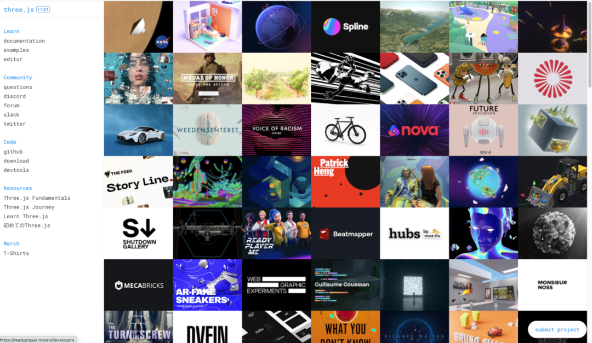
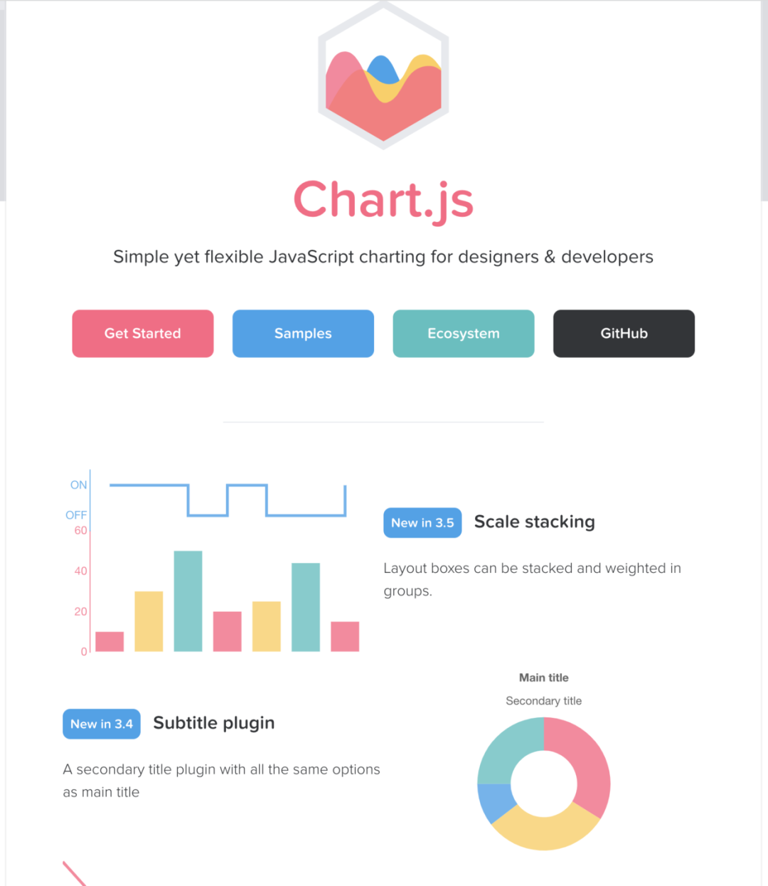
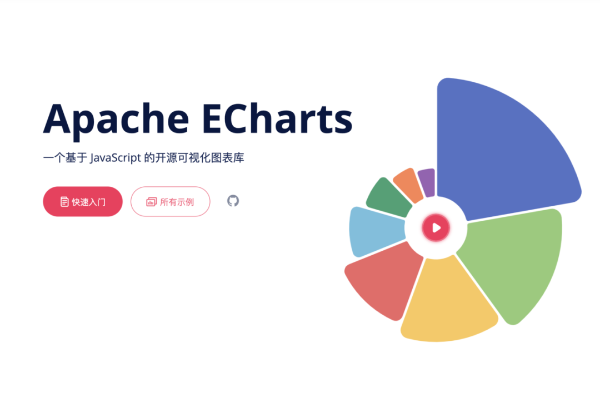
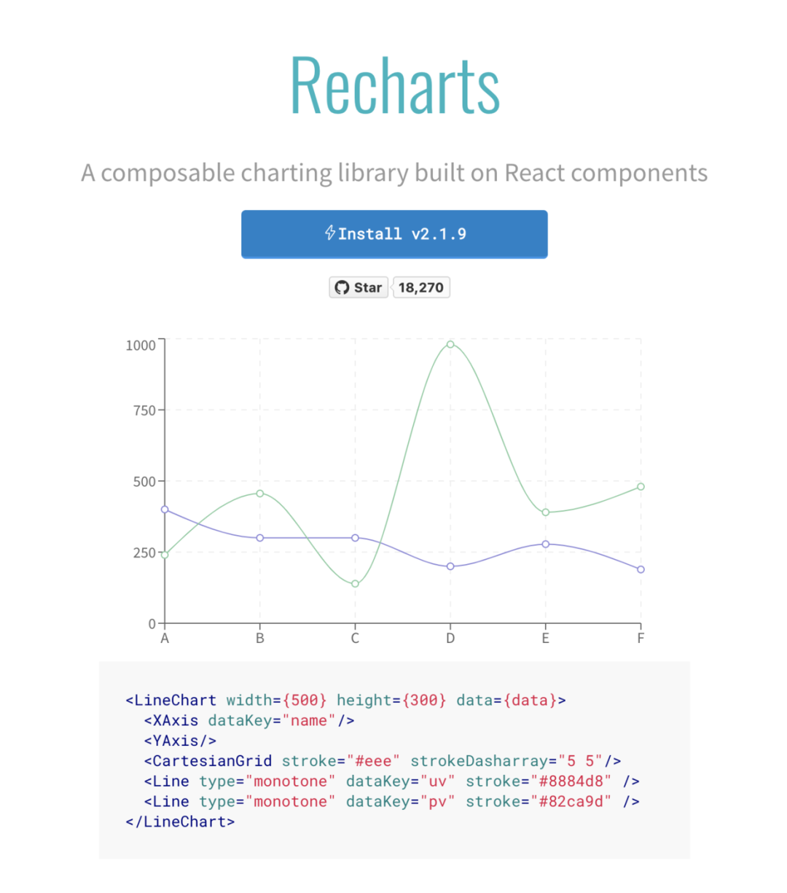
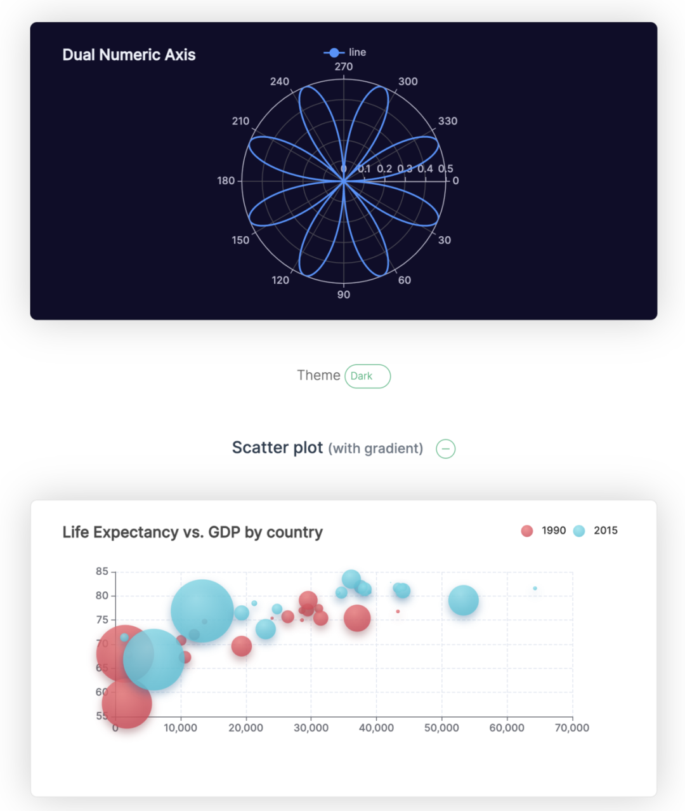
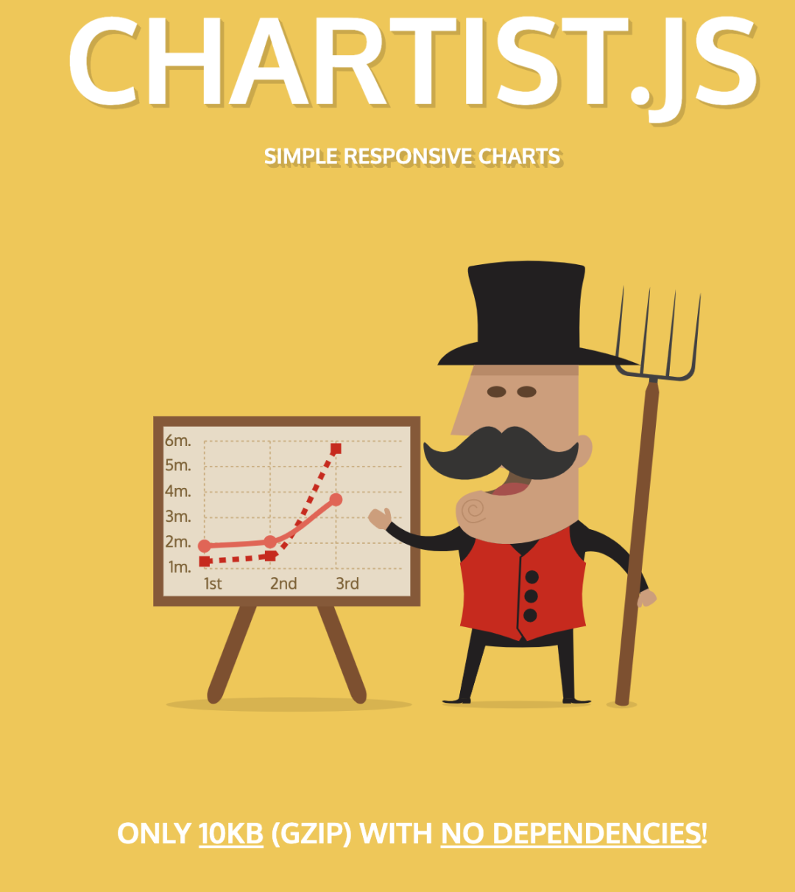
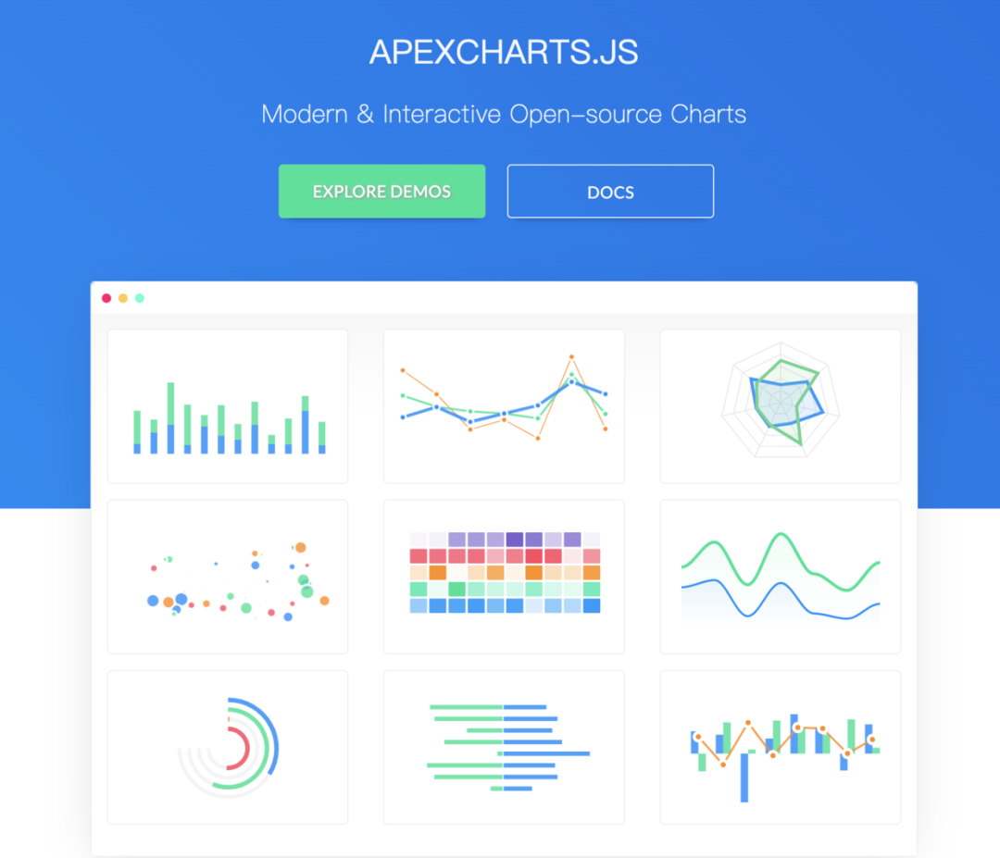
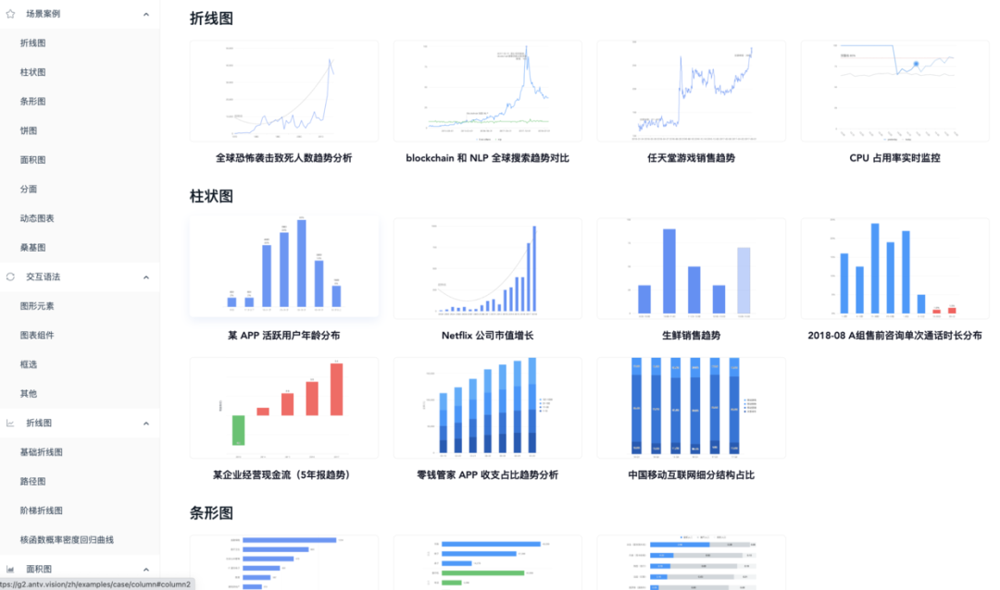
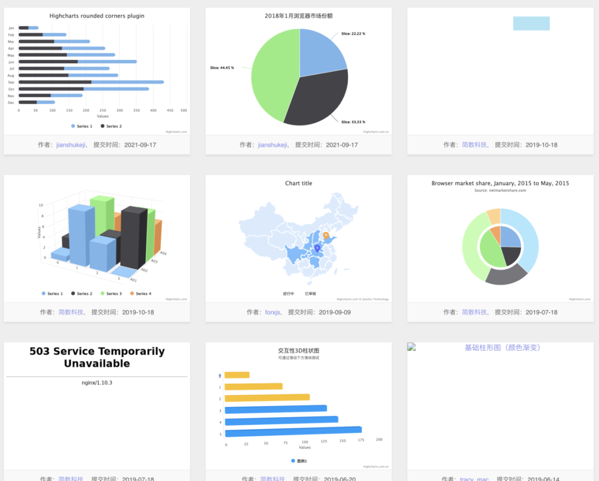
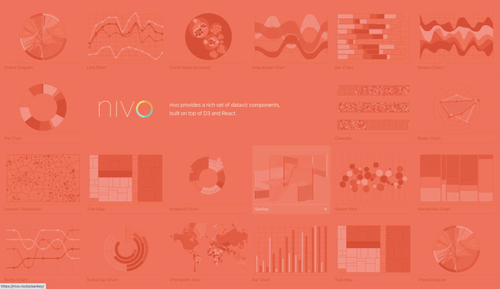

## 可视化图表

### 1. three.js

JavaScript 3D Library.

这个项目，做为前端开发都应该知道的哈！

该项目的目的是创建一个易于使用、轻量级、跨浏览器的通用 3D 库。当前的构建仅包含 WebGL 渲染器，但示例中也提供了 WebGPU（实验性）、SVG 和 CSS3D 渲染器。

* 地址:[https://github.com/mrdoob/three.js](https://github.com/mrdoob/three.js)

### 2. Chart.js

为设计人员和开发人员提供简单而灵活的 JavaScript 图表

* 地址:[https://github.com/chartjs/Chart.js](https://github.com/chartjs/Chart.js)

### 3. echarts

Apache ECharts 是一个功能强大的交互式图表和数据可视化库，适用于浏览器

* 地址:[https://github.com/apache/echarts](https://github.com/apache/echarts)

### 4. recharts

Recharts 是一个用 React 和 D3 构建的重新定义的图表库。这个库能帮助你在 React 应用中轻易绘制图表，Recharts 的主要特点：

* 简单地使用 React 组件进行部署
* 支持原生 SVG，轻量级应用一些 D3 子模块
* 地址:[https://github.com/recharts/recharts](https://github.com/recharts/recharts)

### 5. vue-echarts

Apache ECharts 的 Vue.js 组件。

* 地址:[https://github.com/ecomfe/vue-echarts](https://github.com/ecomfe/vue-echarts)

### 6. chartist-js

Chartist.js 是一个非常简单而且实用的 JavaScript 前端图表生成器，它支持 SVG 格式，图表数据转换十分灵活，同时也支持多种图表展现形式，不失为一款前端开发者的开发利器。

* 地址:[https://github.com/gionkunz/chartist-js](https://github.com/gionkunz/chartist-js)

### 7. apexcharts.js

ApexCharts.JS 是一个现代化 JavaScript 图表库，用于使用简单的 API 构建交互式图表和可视化

* 地址:[https://github.com/apexcharts/apexcharts.js](https://github.com/apexcharts/apexcharts.js)

### 8. G2

G2 是一套基于图形语法理论的可视化底层引擎，以数据驱动，提供图形语法与交互语法，具有高度的易用性和扩展性。使用 G2，你可以无需关注图表各种繁琐的实现细节，一条语句即可使用 Canvas 或 SVG 构建出各种各样的可交互的统计图表。

* 地址:[https://github.com/antvis/G2](https://github.com/antvis/G2)

### 9. highcharts

让数据可视化更简单 兼容 IE6+、完美支持移动端、图表类型丰富、方便快捷的 HTML5 交互性图表库

* 地址:[https://github.com/highcharts/highcharts](https://github.com/highcharts/highcharts)

### 10. nivo

nivo提供增压的 React 组件来轻松构建 dataviz 应用程序，它建立在 d3 之上。

已经存在几个用于 React d3 集成的库，但只有少数提供了服务器端渲染能力和完全声明性的图表。

* 地址:[https://github.com/plouc/nivo](https://github.com/plouc/nivo)

### 更多GetHub仓库

* 地址:[https://github.com/FrontEndGitHub/FrontEndGitHub](https://github.com/FrontEndGitHub/FrontEndGitHub)

## END

---
