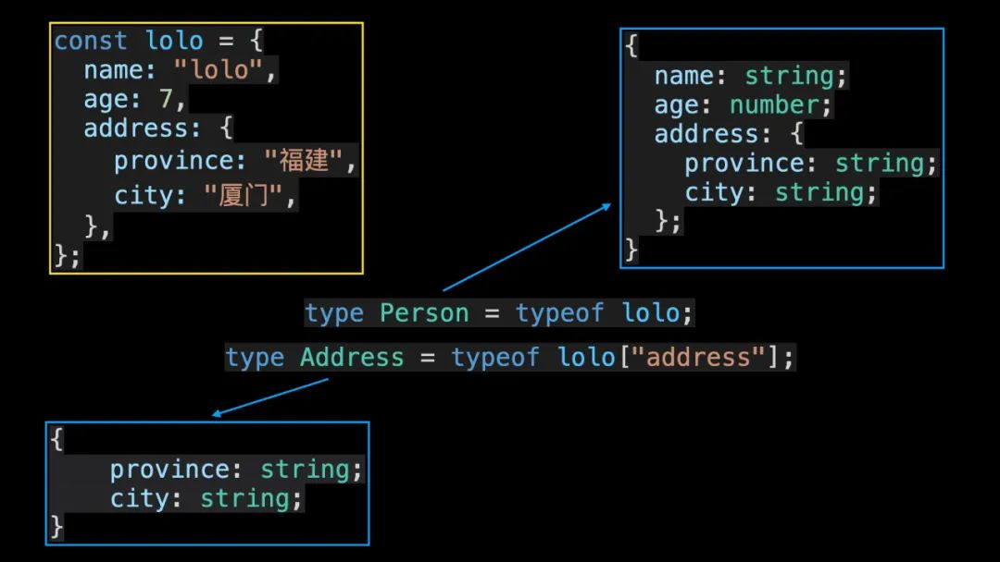
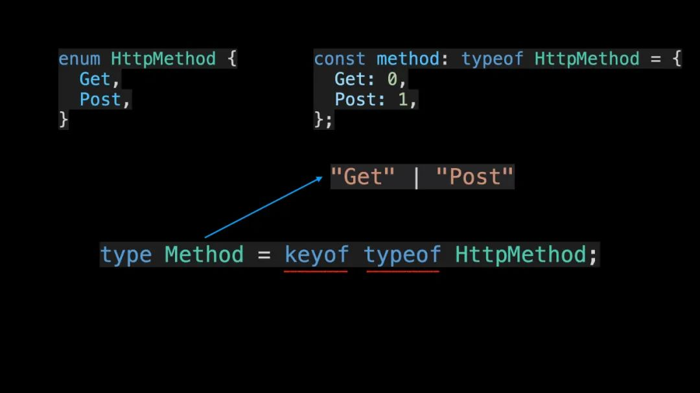
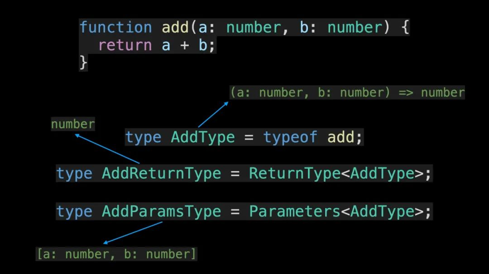
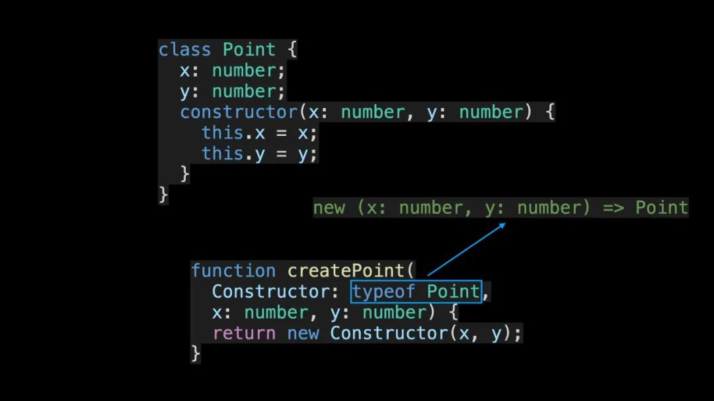
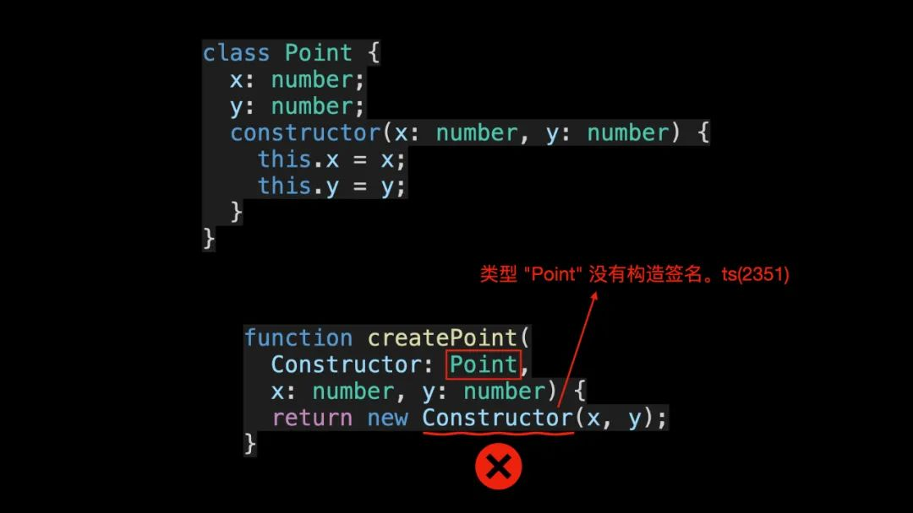
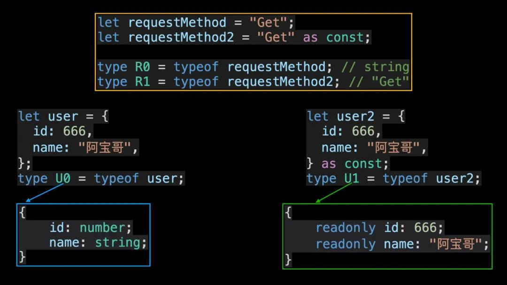

### 定义对象类型

```js
const lolo = {
  name: "lolo",
  age: 7,
  address: {
    province: "福建",
    city: "厦门",
  },
};

interface Person {
  name: string;
  age: number;
  address: {
    province: string;
    city: string;
  };
}
```

* 层级嵌套较深时 typeof 操作符：

```js
type Person = typeof lolo;
type Address = typeof lolo["address"];
```



### 处理enum类型

```js
enum HttpMethod {
  Get,
  Post,
}

"use strict";
var HttpMethod;
(function (HttpMethod) {
    HttpMethod[HttpMethod["Get"] = 0] = "Get";
    HttpMethod[HttpMethod["Post"] = 1] = "Post";
})(HttpMethod || (HttpMethod = {}));
```

* 可以对枚举类型使用typeof操作符，处理枚举类型时，一般搭配keyof操作符

```js
const method: typeof HttpMethod = {
  Get: 0,
  Post: 1,
};

type Method = keyof typeof HttpMethod; // "Get" | "Post"
```



* 由以上结果可知，利用 keyof 和 typeof 操作符，你就可以获取枚举类型的所有属性名。

### 获取函数对象的类型

```js
function add(a: number, b: number) {
  return a + b;
}

type AddType = typeof add; // (a: number, b: number) => number
type AddReturnType = ReturnType<AddType> // number
type AddParamsType = Parameters<AddType> // [a: number, b: number]
```

* TypeScript 内置的 ReturnType 和 Parameters 工具类型来分别获取函数的返回值类型和参数类型：


### 处理class

```js
class Point {
  x: number;
  y: number;
  constructor(x: number, y: number) {
    this.x = x;
    this.y = y;
  }
}

// new (x: number, y: number) => Point
function createPoint(Constructor: typeof Point, x: number, y: number) {
  return new Constructor(x, y);
}
```



> 在以上代码中，createPoint 是一个工厂函数，用于快速创建 Point 类的实例。通过 typeof 操作符，你就可以获取 Point 类对应的构造签名，从而实现相应的类型校验。在定义 Constructor 参数类型时，如果不使用 typeof 操作符的话，将会出现以下错误信息：

```js
function createPoint(Constructor: Point, x: number, y: number) {
  return new Constructor(x, y);  // Error：类型 "Point" 没有构造签名。ts(2351)
}

```



### 配合const断言（TypeScript 3.4)

```js
let requestMethod = "Get";
let requestMethod2 = "Get" as const;

type R0 = typeof requestMethod; // string
type R1 = typeof requestMethod2; // "Get"

let user = {
  id: 666,
  name: "阿宝哥",
};

let user2 = {
  id: 666,
  name: "阿宝哥",
} as const;

// { id: number; name: string; }
type U0 = typeof user;
// type U1 = { readonly id: 666; readonly name: "阿宝哥"; }
type U1 = typeof user2;
```



* 由以上结果可知，使用 const 断言之后，再利用 typeof 操作符，我们就可以获得更精确的类型。

## END

---
