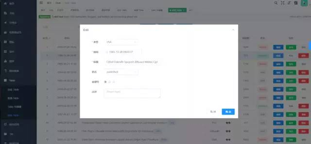
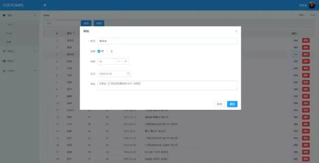
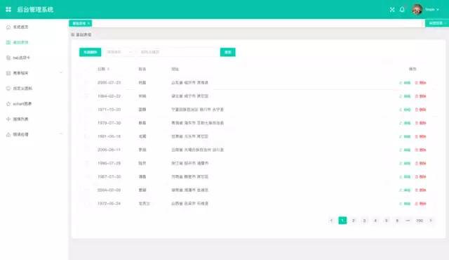
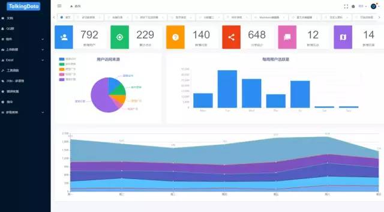
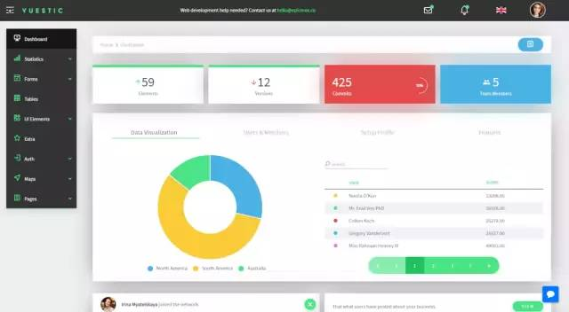
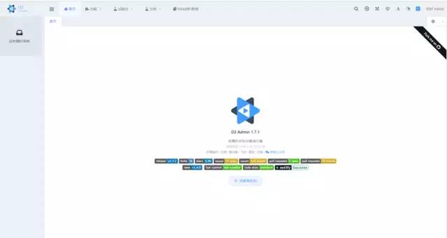

## 6款Vue管理后台框架

### 1、element

Element UI 是一套采用 Vue 2.0 作为基础框架实现的组件库，它面向企业级的后台应用，能够帮助你快速地搭建网站，极大地减少研发的人力与时间成本

* 官网：[`http://element.eleme.io`](http://element.eleme.io)
* 地址：[`https://github.com/PanJiaChen/vue-element-admin`](https://github.com/PanJiaChen/vue-element-admin)

### 2、Vue Admin

Vue Admin 是一个基于 Vue 2.0 & Bulma 0.3 的后台管理面板（管理系统），相当于是 Vue 版本的 Bootstrap 管理系统，提供了一组通用的后台界面 UI 和组件，其中还有丰富的图表组件，开箱即用

* 官网：[`https://admin.vuebulma.com`](https://admin.vuebulma.com)
* 地址：[`https://github.com/taylorchen709/vue-admin`](https://github.com/taylorchen709/vue-admin)

### 3、vue-manage-system

>基于Vue.js 2.x系列 + Element UI 的后台管理系统解决方案 ,弥补了element中缺少图片裁剪上传、富文本编辑器、图表等这些在后台管理系统中很常见的功能。适用于绝大部分的后台管理系统（Web Management System）开发。
>基于vue.js,使用vue-cli脚手架快速生成项目目录，引用Element UI组件库，方便开发快速简洁好看的组件。分离颜色样式，支持手动切换主题色，而且很方便使用自定义主题色

* 地址：[`https://github.com/lin-xin/vue-manage-system`](https://github.com/lin-xin/vue-manage-system)

### 4、iview-admin

基于Vue.js，搭配使用iView UI组件库形成的一套后台集成解决方案，由TalkingData前端可视化团队部分成员开发维护。iView admin遵守iView设计和开发约定，风格统一，设计考究，并且更多功能在不停开发中。

* 地址：[`https://github.com/iview/iview-admin`](https://github.com/iview/iview-admin)

### 5、vuestic-admin

一个响应式的仪表盘模板，采用Bootstrap 4和Vue.js构建。这个精美的管理台模板提供了自定义元素组件，如地图，聊天，个人资料卡，图标，进度条等，以及用于登录和注册的预建页面。

* 地址：[`https://github.com/epicmaxco/vuestic-admin`](https://github.com/epicmaxco/vuestic-admin)

### 6、d2-admin

基于 vue.js 和 ElementUI 的管理系统前端解决方案 。
D2Admin 是一个完全 开源免费 的企业中后台产品前端集成方案，使用最新的前端技术栈，已经做好大部分项目前期准备工作，并且带有大量示例代码，助力管理系统敏捷开发。

* 地址：[`https://github.com/d2-projects/d2-admin`](https://github.com/d2-projects/d2-admin)

## END

---
