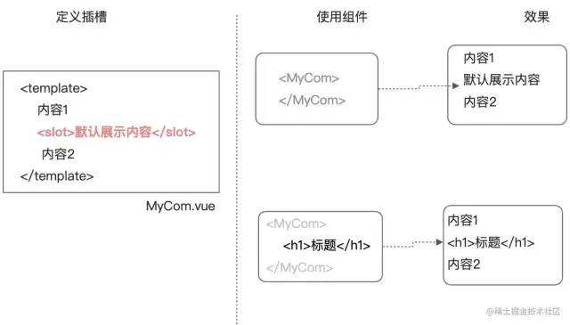
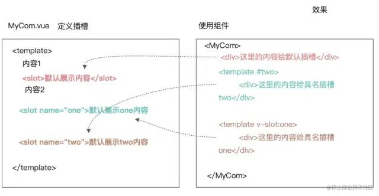
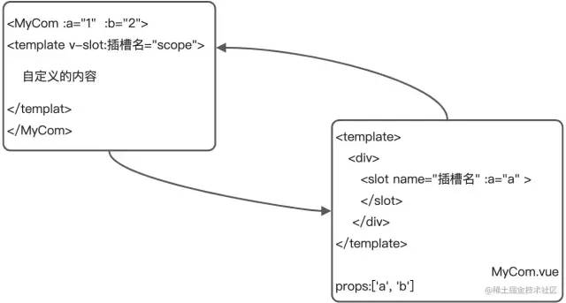

## 动态组件和插槽

### 组件进阶-props校验

**<mark>props校验</mark>**

* 普通格式：props: ["propA", "propB"]。没有类型检查
高阶格式：

```vue
props: {
    // 基础的类型检查 (`null` 和 `undefined` 会通过任何类型验证)
    propA: Number,
    // 多个可能的类型
    propB: [String, Number],
    // 必填的字符串
    propC: {
      type: String,
      required: true
    },
    // 带有默认值的数字
    propD: {
      type: Number,
      default: 100
    },
    // 带有默认值的对象
    propE: {
      type: Object,
      // 对象或数组默认值必须从一个工厂函数获取
      default: function () {
        return { message: 'hello' }
      }
    },
    // 自定义验证函数
    propF: {
      validator: function (value) {
        // 这个值必须匹配下列字符串中的一个
        return ['success', 'warning', 'danger'].indexOf(value) !== -1
      }
    }
  }
```

### 组件进阶 - 动态组件

* 需求: 完成一个注册功能页面, 2个按钮切换, 额外封装两个组件：一个填写注册信息, 一个填写用户简介信息
* 目标: 多个组件使用同一个挂载点，并可以动态切换，这就是动态组件
**目录结构**

```shell
# 根组件
├── App.vue
└── components
    ├── UserName.vue # 用户名和密码输入框
    └── UserInfo.vue # 人生格言和自我介绍框
```

**格式**

```html
<component :is="comName"></component>
```

**操作**
UserName.vue

```vue
<template>
  <div>
    <h2>UserName</h2>
    <p>用户名:<input /> </p>
    <p>密码:<textarea /> </p>
  </div>
</template>

<script>
export default {

}
```

* 在父组件App.vue中使用

```vue
<template>
  <div>
    <button @click="comName = 'UserName'">账号密码填写</button>
    <button @click="comName = 'UserInfo'">个人信息填写</button>

    <p>下面显示注册组件:</p>
    <div style="border: 1px solid red">
      <!-- vue内置的组件component, 可以动态显示组件 -->
      <component :is="comName"></component>
    </div>
  </div>
</template>

<script>
import UserName from "./UserName";
import UserInfo from "./UserInfo";
export default {
  data() {
    return {
      comName: "UserName",
    };
  },
  components: {
    UserName,
    UserInfo,
  },
};
</script>
```

**注意**

* is只能是动态属性=》:is="组件注册后的标签名字符串或data变量"
* 不能直接拿注册标签名赋值使用

* vue内置component组件, 配合is属性, 设置要显示的组件标签名字

### 组件进阶-keep-alive组件

组件切换会导致组件被频繁销毁和重新创建, 大多数情况下是有自己的意义的，但也可能会导致不必要的性能损耗

* keep-alive
使用Vue内置的keep-alive组件, 可以让包裹的组件保存在内存中不被销毁

> 补充生命周期:

* activated - 激活
* deactivated - 失去激活状态

```html
<keep-alive>
    <!-- vue内置的组件component, 可以动态显示组件 -->
    <component :is="comName"></component>
</keep-alive>
```

keep-alive可以提高组件的性能, 内部包裹的标签不会被销毁和重新创建, 触发激活和非激活的生命周期方法

### 组件进阶-keep-alive组件-指定缓存

* 语法
  * `include="组件名1,组件名2..."`
  * `:include="['组件名1'， '组件名2']"`

```html
<keep-alive include="name1,name2">
    <!-- vue内置的组件component, 可以动态显示组件 -->
    <component :is="comName"></component>
</keep-alive>
```

* 匹配首先检查组件自身的 name 选项，如果 name 选项不可用，则匹配它的局部注册名称 (父组件 components 选项的键值)

### 组件进阶 - 默认插槽

**vue中的插槽**

* 组件通过插槽传入自定义结构
* 用于实现组件的内容分发, 通过 slot 标签, 可以接收到写在组件标签内的内容
* vue提供组件插槽能力, 允许开发者在封装组件时，把不确定的部分定义为插槽

**格式**
在定义组件时，在template中用slot来占个坑；
>使用时，将组件之间的内容来填坑；


### 组件进阶-具名插槽

当一个组件内有2处以上需要外部传入标签的地方

* `<template #xxx>`;


* 传入的标签可以分别派发给不同的slot位置
* v-slot一般跟template标签使用 (template是html5新出标签内容模板元素, 不会渲染到页面上, 一般被vue解析为内部标签)

**例**

1. 子组件-Pannel2.vue

```html
<div class="container" v-show="isShow">
    <slot name="one"></slot>
    <slot name="two"></slot>
</div>
```

2. 父组件-UseSlot2.vue

* v-bind可以省略成:

* v-on: 可以省略成@

* v-slot: 可以简化成#

写法1

```html
<Pannel2>
    <template v-slot:one>
  
    </template>
    <template v-slot:two>
  <span>我是文字哦</span>
    </template>
</Pannel2>
```

写法2

```html
<Pannel2>
    <!-- 简化写法 -->
    <template #one>
  <div>
            <p>寒雨连江夜入吴,</p>
            <p>平明送客楚山孤。</p>
            <p>洛阳亲友如相问，</p>
            <p>一片冰心在玉壶。</p>
        </div>
    </template>
    <template #two>
  
    </template>
</Pannel2>
```

* slot有可以设置多个
* 定义组件时：slot的name属性起插槽名
* 使用组件时, template配合#插槽名传入具体html标签或组件

### 组件进阶-作用域插槽



1. 目标:

* 子组件中的数据, 在给插槽赋值时在父组件环境下使用=> 子传父=》传数据

2. 步骤

* 创建子组件, 准备slot, 在slot上绑定属性和子组件值
* 使用子组件, 传入自定义标签, 用template和v-slot="自定义变量名"
* 自定义变量名会自动绑定slot上所有属性, 就可以使用子组件内值, 并替换* slot位置

3. 例

* 子组件

```vue
  <template>
  <div style="border:1px solid #ccc; margin:5px;padding:5px">
    <h2>子组件</h2>
    <!-- 给slot上补充自定义的属性 -->
    <slot name="content" :a="1" :b="2">
      默认内容
    </slot>
  </div>

</template>

<script>
export default {
}
</script>

```

* 父组件

```vue
<template>
  <div style="border:1px solid #ccc; margin:5px;padding:5px">
    <h1>45-插槽-作用域插槽</h1>


    <MyCom>
      <!-- 
        v-slot:插槽名="对象" 
      对象会自动接收这个插槽传递回来自定义属性
      -->
      <template v-slot:content="scope">
        <!-- <h1>自定义的内容，填坑, {{scope}}</h1> -->
        <h3>{{scope.a}}</h3>
        <p>{{scope.b}}</p>
      </template>
    </MyCom>
  </div>
</template>

<script>

// 父传子
//  1.传数据。 自定义属性    （父）  props(子)
//  2.传结构。 在组件中写内容（父）  slot (子)

import MyCom from './MyCom.vue'
export default {
  components: { MyCom }
}
</script>

<style scoped>
.content{
background-color: #ccc;
}
</style>
```

组件内变量绑定在slot上, 然后使用组件v-slot:插槽名字="变量" ，变量上就会绑定slot传递的属性和值

### 自定义指令-基本使用

除了核心功能默认内置的指令 (v-model 和 v-show)等，Vue 也允许注册自定义指令=》 v-xxx

* html+css+js的复用的主要形式是组件
* 你需要对普通 DOM 元素进行底层操作，这时候就会用到自定义指令

1. 作用

* 扩展标签额外的功能

2. 自定义指令-定义方式

```js
{
  data(){},
  methods: {},
  directives: {
    focus: { // 自定义指令名
        inserted(el){ // 固定配置项 - 当指令插入到标签自动触发此函数
            el.focus()
        }
    },
  },
}
```

3. 示例 自动获取焦点

```vue
<template>
  <div>
    <input type="text" v-focus />
  </div>
</template>

<script>
export default {
  // 注册
  directives: {
    focus: { // 自定义指令名
        inserted(el){ // 固定配置项 - 当指令插入到标签自动触发此函数
            el.focus()
        }
    }
  }
}
</script>
```

### 自定义指令-传值和更新

1. 目标: 使用自定义指令, 传入一个值

2. 需求: 定义color指令-传入一个颜色, 给标签设置文字颜色
main.js定义处修改一下

```js
directives: {
  "color":{
    inserted(el, binding){ // 插入时触发此函数
      el.style.color = binding.value;
    },
    update(el, binding){ // 更新绑定的变量时触发此函数=》手动更新
      el.style.color = binding.value;
    }
  }
}
```

Direct.vue处更改一下

```html
<p v-color="theColor" @click="changeColor">使用v-color指令控制颜色, 点击变蓝</p>

<script>
  data() {
    return {
      theColor: "red",
    };
  },
  methods: {
    changeColor() {
      this.theColor = 'blue';
    },
  },
</script>
```

v-xxx, 自定义指令, 获取原生DOM, 自定义操作

## END

---
