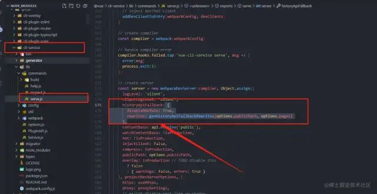
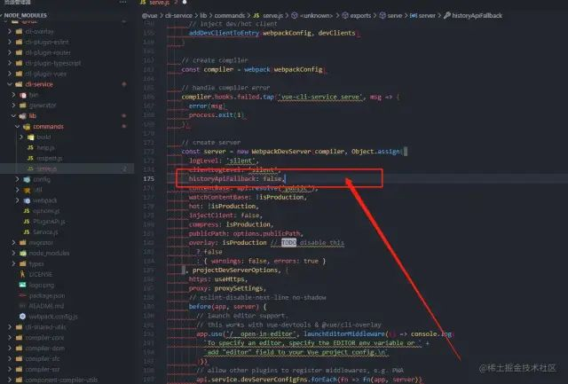

## hash 与 history 差异

### Vue Router

* Vue Router 是 Vue.js 官方的路由插件，它和 Vue.js 是深度集成的，适合用于构建单页面应用。vue的单页面应用是基于路由和组件的，路由用于设定访问路径，并将路径和组件映射起来。传统的页面应用，是用一些超链接来实现页面切换和跳转的。在 vue-router 单页面应用中，则是路径之间的切换，也就是组件的切换。路由模块的本质 就是建立起url和页面之间的映射关系。
* 至于我们为什么不能用a标签，这是因为用Vue做的都是单页应用，就相当于只有一个主的 index.html 页面，所以你写的 标签是不起作用的，你必须使用 vue-router 来进行管理

### Vue Router 实现原理

* 在了解路由模式前，我们要先清楚，vue-roter 的实现原理是怎样的，什么是单页面应用，特点是什么，这样更容易加深对路由的理解。

* SPA 单页面及应用方式:单一页面应用程序，只有一个完整的页面；它在第一次加载页面时,就将唯一完整的 html 页面和所有其余页面组件一起下载下来，这样它在切换页面时，不会加载整个页面，而是只更新某个指定的容器中内容。

* 单页面应用(SPA)的核心之一是: 更新视图而不重新请求页面。

* 路由器对象底层实现的三大步骤即(1)监视地址栏变化；(2)查找当前路径对应的页面组件；(3)将找到的页面组件替换到 router-vieW 的位置。

* vue-router 在实现单页面前端路由时，提供了两种方式：Hash 模式和 History 模式；vue2 是根据 mode 参数来决定采用哪一种方式，vue3 则是 history 参数，下面我们将围绕这个属性进行进一步了解


### Hash

**简述**

* vue-router 默认 hash 模式 —— 使用 URL 的 hash 来模拟一个完整的 URL，于是当 URL 改变时，页面不会重新加载。 hash（#）是 URL 的锚点，代表的是网页中的一个位置，单单改变 # 后的部分，浏览器只会滚动到相应位置，不会重新加载网页，也就是说 # 是用来指导浏览器动作的，对服务器端完全无用，HTTP 请求中也不会不包括 # ，同时每一次改变 # 后的部分，都会在浏览器的访问历史中增加一个记录，使用 "后退" 按钮，就可以回到上一个位置，所以说 hash 模式通过锚点值的改变，根据不同的值，渲染指定 DOM 位置的不同数据。

* `#` 符号本身以及它后面的字符称之为 hash，可通过 window.location.hash 属性读取
**特点**
* hash 虽然出现在URL中，但不会被包括在 HTTP 请求中。它是用来指导浏览器动作的，对服务器端完全无用，因此，改变 hash 不会重新加载页面
* 可以为 hash 的改变添加监听事件

```js
 window.addEventListener("hashchange", fncEvent, false)
```

* 每一次改变 hash（window.location.hash），都会在浏览器的访问历史中增加一个记录
* url 带一个 # 号。
**设置**
* vue3 设置 hash 模式路由


### history

**简述**

* history 是路由的另一种模式，由于 hash 模式会在 url 中带#，如果不想要带 #的话，我们可以使用路由的 history 模式，只需要在响应的 router 配置规则时,加上即可，vue 的路由默认是 hash 模式。
* 利用了HTML5 History Interface中新增的 pushState() 和 replaceState() 方法。
* 这两个方法应用于浏览器的历史记录栈，在当前已有的 back、forward、go 的基础之上，它们提供了对历史记录进行修改的功能。只是当它们执行修改时，虽然改变了当前的 URL，但浏览器不会立即向后端发送请求。

**特点**

* 路由跳转不需要重新加载页面。
* 不带 # 在大部分人看来要比 hash 路由好看许多。
* 兼容性没有 hash 好，会在下面展开说明
*生产环境问题及解决*
* 当我们把 history 项目部署到服务器中后,此时我们在浏览器输入一个网址(比如是 www.test.com[3] ), 此时会经过 dns 解析，拿到 ip 地址后根据 ip 地址向该服务器发起请求,服务器接受到请求后,然后返回相应的结果(html,css,js)。如果我们在前端设置了重定向，此时页面会进行跳转到 www.test.com/home[4] ,在前端会进行匹配对应的组件然后将其渲染到页面上。此时如果我们刷新页面的话，浏览器会发送新的请求 www.test.com/home[5], 如果后端服务器没有 /home 对应的接口，那么就会返回404。
* 生产环境 刷新 404 的解决办法可以在 nginx 做代理转发，在 nginx 中配置按顺序检查参数中的资源是否存在，如果都没有找到，让 nginx 内部重定向到项目首页。

*开发环境- historyApiFallback*

* 有些小伙伴会有疑问,为什么开发环境没有遇到这个问题呢，不是和生产同样的刷新操作嘛
* 这里我也是疑问了一下，经查阅相关资料后发现在 vue-cli 中 webpack 帮我们做了处理



* 如果我们把该配置改位 false,浏览器会把我们这个当做是一次 get 请求，如果后端没有对应的接口,就会出现下面这个报错提示。




### 总结

* 至此我们使用知道了 vue-roter 的两种路由模式，及差异化，简单来讲就是，hash 路由兼容梗好，但是带#显得丑些， histroy 和正常 url 路径一样，但是需要在服务器进行单独配置.

## END

---
