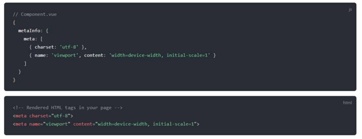

## Vue 插件

### Vuetify

* 教程：[https://www.vuemastery.com/courses/beautify-with-vuetify/getting-started-with-vuetify](https://www.vuemastery.com/courses/beautify-with-vuetify/getting-started-with-vuetify)

 你是否曾纠结于如何让应用在视觉上看起来更吸引人?Vuetify是一个基于Material Design的UI库，支持谷歌和Android的设计语言。

它是一个开源库，有数百个组件，从按钮， app bars，chips，modals 和更多。这些组件都是预先设计好的，非常实用，让你能够通过文档化的 props 和插槽与它们进行交互。预先定义的CSS类也可用于控制颜色、字体、网格间距、弹性框等。

### NuxtJS

Nuxt 基于一个强大的模块化架构。你可以从 50 多个模块中进行选择，让你的开发变得更快、更简单。对 PWA 的支持、添加谷歌分析到你的网页或生成网站地图，这些功能都无需重新发明轮子来获得。

NuxtJS目前基于Vue 2。但是nux3最近已经发布，并且已经完全重写以支持Vue 3。

### Vuex

Vuex 是一个专为 Vue.js 应用程序开发的状态管理模式。它采用集中式存储管理应用的所有组件的状态，并以相应的规则保证状态以一种可预测的方式发生变化。

Vuex 也集成到 Vue 的官方调试工具 devtools extension (opens new window)，提供了诸如零配置的 time-travel 调试、状态快照导入导出等高级调试功能。

### Vuex Persisted State

Vuex状态机制，一刷新就会重置，解决问题的方式一般都是存储起来(session/local Storage)，vuex-persistedstate插件帮我们集成了这些功能。

### VuePress

VuePress 是一款使用 Vue 驱动的静态网站生成器，是 Vue 的作者 Evan You 为了方便文档的编写而开发的。

* 默认主题与 Vue 官方文档一致
* 简洁，少配置，高性能
* Markdown 专为技术文档提供拓展
* 自带 PWA
* 自定义主题，可定制程度完全由自己决定

### Vue Meta

* 地址：[https://vue-meta.nuxtjs.org/](https://vue-meta.nuxtjs.org/)

基于Vue 2.0 的 vue-meta 插件，主要用于管理HMTL头部标签，同时也支持SSR。

vue-meta有以下特点：

* 在组件内设置 metaInfo，便可轻松实现头部标签的管理
* metaInfo 的数据都是响应的，如果数据变化，头部信息会自动更新 支持 SSR

### Vue ChartJS

* 地址：[https://www.npmjs.com/package/vue-chartjs](https://www.npmjs.com/package/vue-chartjs)

想在你的Vue应用程序中添加图表？可以看看 Chart.js。它是一个为设计师和开发者提供的简单而灵活的 JS 图表库。它有许多漂亮的图表类型可供选择。

### Vue Grid Layout

* 地址：[https://jbaysolutions.github.io/vue-grid-layout/](https://jbaysolutions.github.io/vue-grid-layout/)

Vue Grid Layout 是一个类似于 Gridster 的栅格布局系统, 适用于 Vue.js，灵感来源于React Grid Layout。

**特性**

* 可拖拽
* 可调整大小
* 静态部件（不可拖拽、调整大小）
* 拖拽和调整大小时进行边界检查
* 增减部件时避免重建栅格
* 可序列化和还原的布局
* 自动化 RTL 支持
* 响应式

### Vue Draggable

* 地址：[https://www.npmjs.com/package/vuedraggable](https://www.npmjs.com/package/vuedraggable)

Vue.Draggable 是一款基于 Sortable.js 实现的vue拖拽插件。支持移动设备、拖拽和选择文本、智能滚动，可以在不同列表间拖拽、不依赖 jQuery 为基础、vue2 过渡动画兼容、支持撤销操作，总之是一款非常优秀的vue拖拽组件。

### Vee-Validate

* 地址：[https://www.npmjs.com/package/vee-validate](https://www.npmjs.com/package/vee-validate)

为了确保通过表单从用户那里收集正确类型的数据，有必要验证表单，以确保用户输入符合预期的模式。VeeValidate是一个可以将这一层功能添加到任何表单组件的包。

### Vue Toastification

* 地址：[https://vue-toastification.maronato.dev/](https://vue-toastification.maronato.dev/)

Vue Toastification 是一个轻量、易用且美观的提示条通知组件，提供了大量的选项来支持大部分自定义选择。

### Vue Tour

* 地址：[https://github.com/pulsardev/vue-tour](https://github.com/pulsardev/vue-tour)

Vue Tour是轻巧、简单且可自定义的新手指引插件，可与Vue.js一起使用。它提供了一种快速简便的方法来指导用户使用您的应用程序。

### Swiper.js

* 地址：[https://swiperjs.com/vue](https://swiperjs.com/vue)

Swiper.js是一个预制的旋转木马组件，可以用来在各种图片之间滑动。Swiper.js 原生支持Vue 3，提供了一个可以插入到你的项目的组件。对于Vue 2，你可以使用其他包，如vue-awesome-swiper。

### vue2-leaflet

* 地址：[https://www.npmjs.com/package/vue2-leaflet](https://www.npmjs.com/package/vue2-leaflet)

vue2-leaflet是对ledflet的封装，vue项目中直接使用vue2-leaflet即可。Leaflet.js 是一个开源库，使用它可以部署交互式，简单，轻量级和简单的Web地图。

### TroisJS

* 地址：[https://troisjs.github.io/](https://troisjs.github.io/)

Trois（法语为Three）是一个Vue 3库，用于Three.JS，这是一个流行的WebGL库。

Three.JS对桌面和移动端都有良好的支持。这个库允许你使用VueJS组件为你的网站轻松创建3D内容。你可以使用这个库在你的网站上添加一个3D渲染器，并在你的VueJs文件的`<template>`部分中使用预先建立的组件指定场景细节，如材料、照明、网格、阴影等。

Trois.Js 是Three.js上面的一个包装器，因此不比原始库慢。它还通过自动处置几何体、材料、纹理、渲染器等来简化对象的处置，这在原始库中是不存在的

### vue-scrollama

* 地址：[https://www.npmjs.com/package/vue-scrollama](https://www.npmjs.com/package/vue-scrollama)

一个Vue组件，可轻松设置滚动驱动的交互（又称滚动讲演）。在引擎盖下使用  Scrollama。

### Vue QR Code Reader

* 地址：[https://gruhn.github.io/vue-qrcode-reader/demos/CustomTracking.html](https://gruhn.github.io/vue-qrcode-reader/demos/CustomTracking.html)

QR码(QR code)在当今世界非常普遍。Vue二维码阅读器是一个即插即用的包，允许你添加二维码扫描功能到你的应用程序。

## END

---
